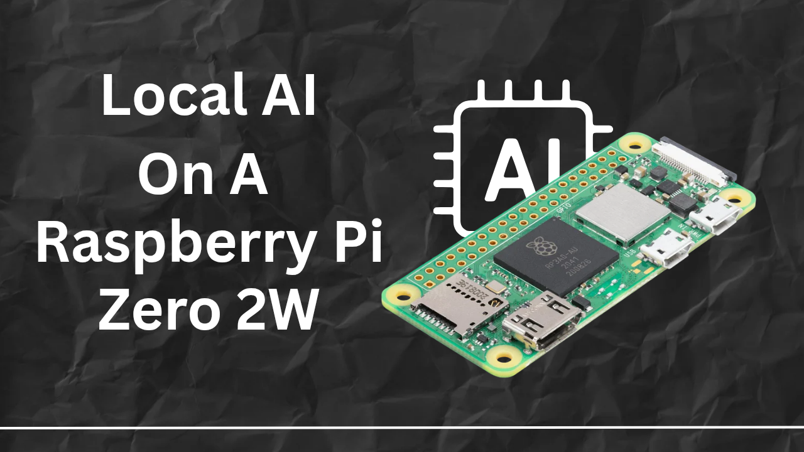

# Local-AI-on-Raspberry-Pi-zero-2w-
I am a 13 year old maker and I am trying to make a project in which I would run a lightweight local ai model on the raspberry pi zero 2w with its tiny 512mb ram

## Bill of Materials (BOM)

| Item | Component | Qty | Unit Price (INR) | Total (INR) | Sourcing / Link |
| :--- | :--- | :---: | :---: | :---: | :--- |
| 1 | Raspberry Pi Zero 2 W | 1 | ₹1,709.00 | ₹1,709.00 | [Raspberry Pi Official](https://www.raspberrypi.com/products/raspberry-pi-zero-2-w/) |
| 2 | SanDisk Ultra Go 32GB MicroSD Card (UHS-I / Class 10) | 1 | ₹1,550.00 | ₹1,550.00 | [Robu.in](https://robu.in/product/sandisk-ultra-go-micro-sdhc-32gb-uhs-i-120mbs-r-class-10-memory-card) |
| **Total** | | | | **₹3,259.00** | *(~$39.00 USD)* |

### Procurement & Sourcing Notes
- **Board Availability:** Sourced domestically via official Raspberry Pi Approved Resellers in India ([Silverline Electronics](https://www.silverlineelectronics.in/) / [Robu.in](https://robu.in)).
- **Storage:** MicroSD pricing accounts for genuine high-endurance Class 10 flash memory via domestic distributors inclusive of local GST.
- **Peripherals:** Reusing personal workbench cables and power supplies to minimize BOM footprint.

